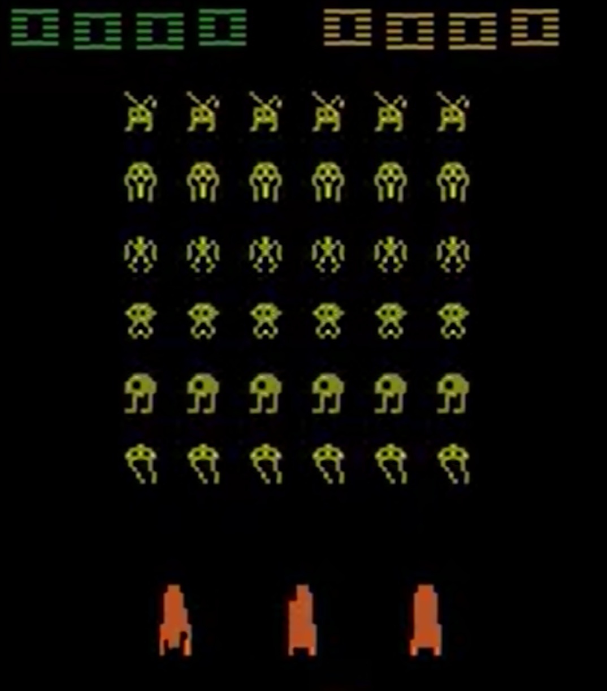
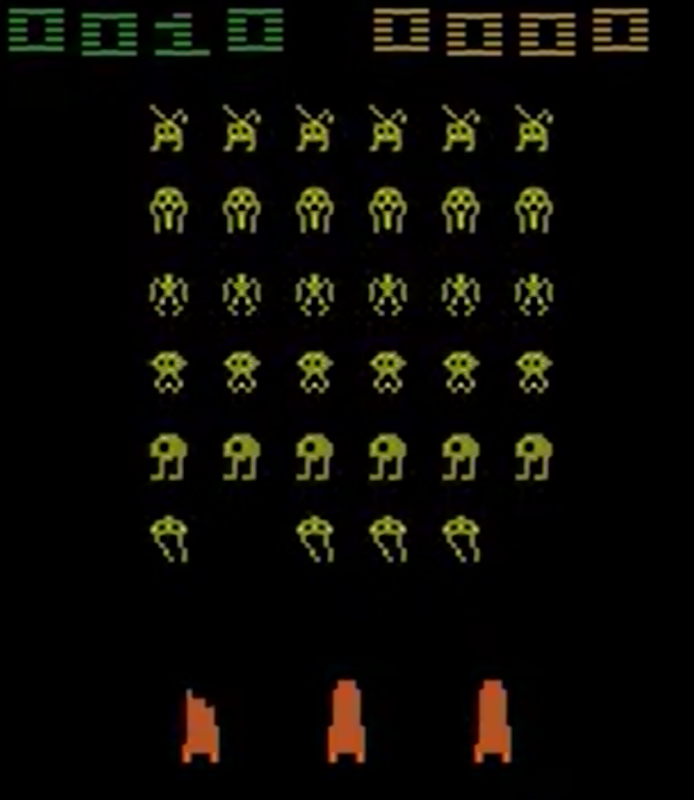

# 166

[SpaceInvaders Docs](https://ale.farama.org/environments/space_invaders/)

## DQN Space Invaders Agent Evaluation

Watch how performance improves as training progresses:

| Episode | Model (notes) | Preview | Video |
|---|---|---|---|
| Early in Training | ` ε=1.00 · R=0.0 · S=29 · tag=test_epsdec50000_rs2000_sync1000` |  | <a href="media/early_video.mp4" target="_blank">▶ Watch</a> |
| Later in Training| `ε=0.01 · R=2.0 · S=41 · tag=test_epsdec50000_rs2000_sync1000` |  | <a href="media/late_video.mp4" target="_blank">▶ Watch</a> |

> 💡 Videos and thumbnails are automatically named based on model performance.
